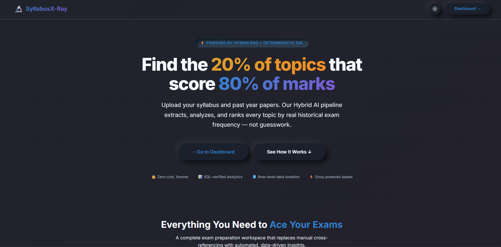
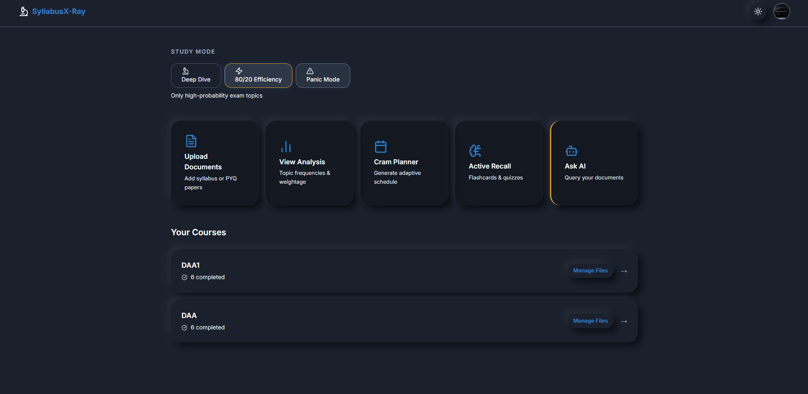
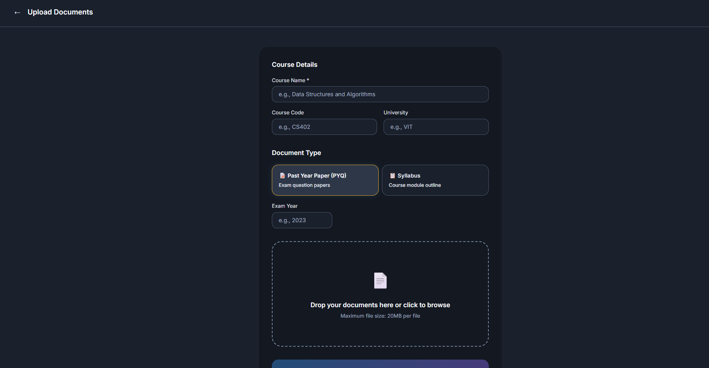
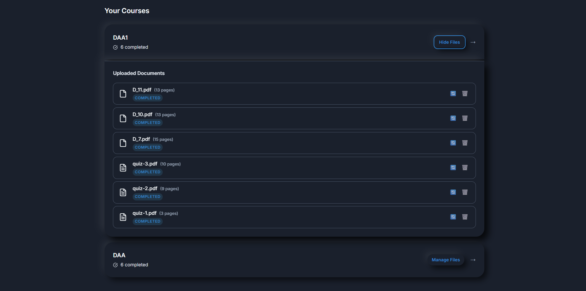
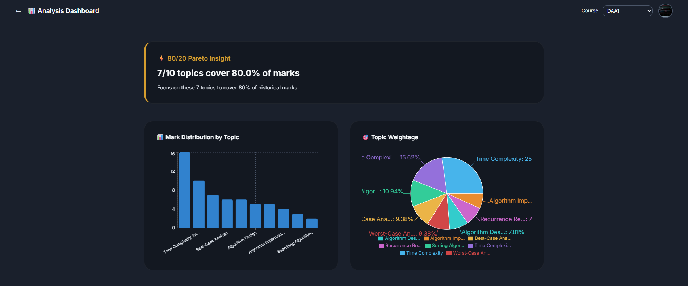
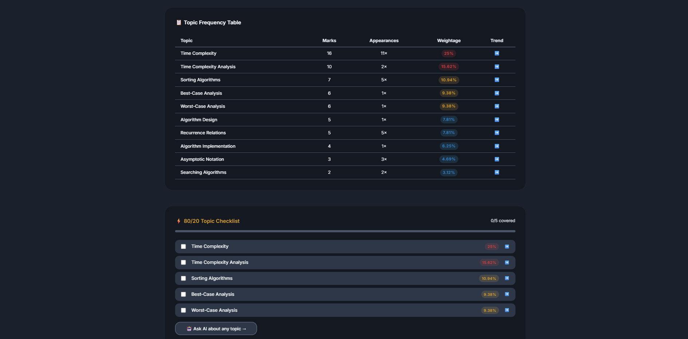
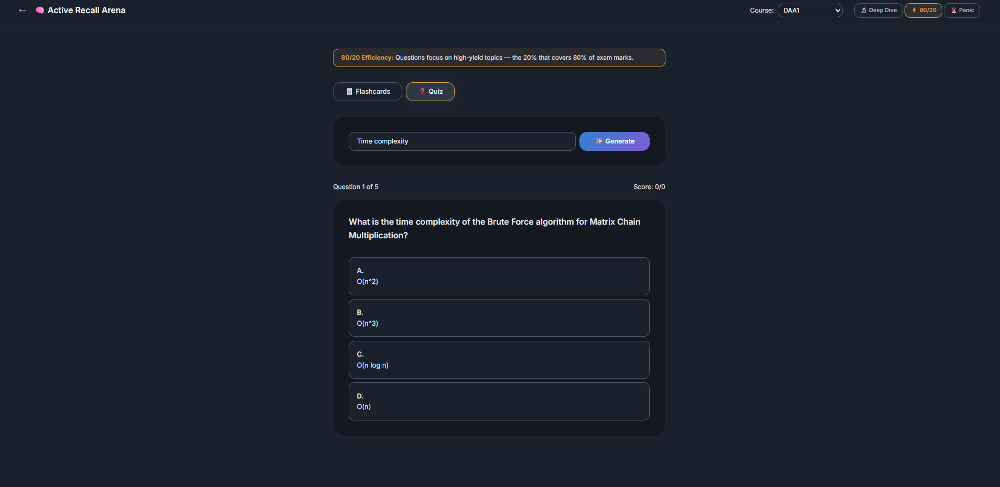
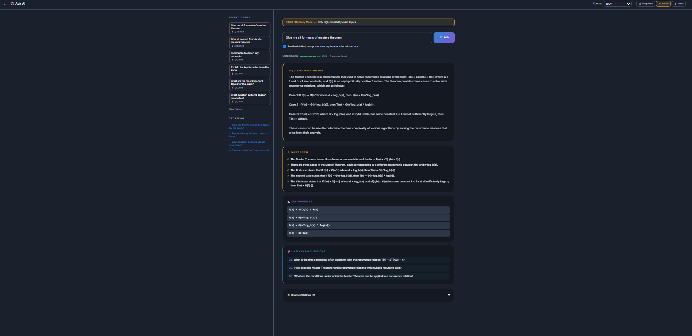
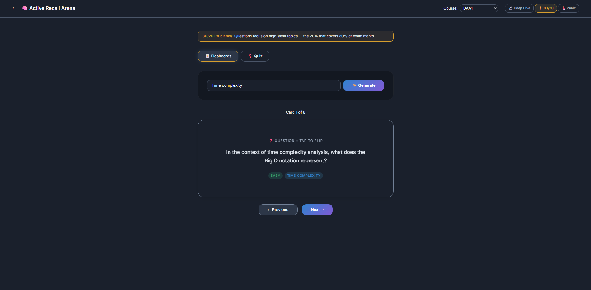
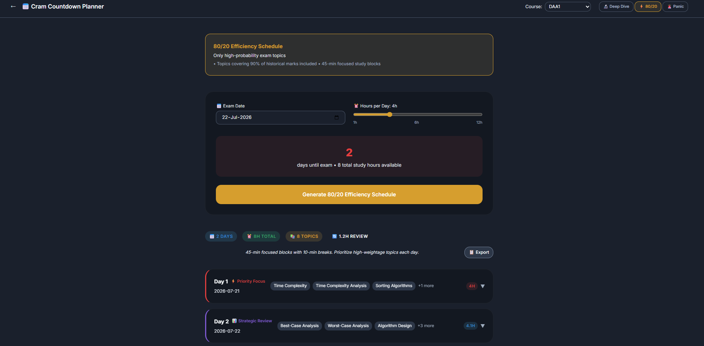

# SyllabusX-Ray

**An AI-powered exam preparation platform that applies the Pareto principle to your coursework.**

Upload your course syllabus and past year question papers. SyllabusX-Ray extracts structured text, computes deterministic analytics to identify which 20% of topics account for 80% of historical marks, and provides a Hybrid RAG pipeline for contextual Q&A, flashcard generation, quizzes, and adaptive study scheduling — all grounded strictly in your own uploaded materials.

---

## Screenshots

<table>
  <tr>
    <td valign="top" width="50%">
      
      <br>
      <b>Landing Page</b><br>
      A clean, modern landing page highlighting the core value proposition of SyllabusX-Ray.
    </td>
    <td valign="top" width="50%">
      
      <br>
      <b>Main Dashboard</b><br>
      Centralized, neomorphic dashboard with quick navigation to all study tools and features.
    </td>
  </tr>
  <tr>
    <td valign="top" width="50%">
      
      <br>
      <b>Upload Documents</b><br>
      Easily upload course syllabi and past year question papers (PYQs) for AI processing.
    </td>
    <td valign="top" width="50%">
      
      <br>
      <b>Course Documents Management</b><br>
      Manage your uploaded files, track processing status, and view document details.
    </td>
  </tr>
  <tr>
    <td valign="top" width="50%">
      
      <br>
      <b>Analysis Dashboard (Charts)</b><br>
      Deterministic SQL analytics compute exact topic frequencies and mark distributions.
    </td>
    <td valign="top" width="50%">
      
      <br>
      <b>Topic Frequency & 80/20 Checklist</b><br>
      Detailed breakdown of topic weightage to focus on the 20% that accounts for 80% of marks.
    </td>
  </tr>
  <tr>
    <td valign="top" width="50%">
      
      <br>
      <b>Hybrid RAG Ask AI</b><br>
      Generate active recall questions and review key concepts directly from your documents.
    </td>
    <td valign="top" width="50%">
      
      <br>
      <b>Ask AI Detailed Responses</b><br>
      Get structured answers, key formulas, and must-know questions based on your specific curriculum.
    </td>
  </tr>
  <tr>
    <td valign="top" width="50%">
      
      <br>
      <b>Active Recall Arena</b><br>
      Generate AI-powered flashcards and quizzes directly from your course materials.
    </td>
    <td valign="top" width="50%">
      
      <br>
      <b>Cram Countdown Planner</b><br>
      Adaptive study schedules prioritizing high-weightage topics based on remaining time.
    </td>
  </tr>
</table>

---

## Key Features

- **Smart Document Extraction** — IBM Docling (DocLayNet AI) accurately extracts multi-column academic papers, preserving tables, reading order, and heading hierarchies. Supports PDF, DOCX, and PPTX.
- **Deterministic Analytics** — Topic frequencies, mark distributions, and year-over-year trends are computed using pure SQL aggregations. No LLM is involved in the analytics path, so results are exact and reproducible.
- **Hybrid RAG Search** — Combines semantic vector search (pgvector) with exact keyword search (PostgreSQL Full-Text Search), merged via Reciprocal Rank Fusion (RRF), and refined using a FlashRank cross-encoder reranker.
- **Adaptive Study Generation** — Generates concise cheatsheets, flashcard decks, and MCQ quizzes tailored to three study modes: Deep Dive, Efficiency, and Panic.
- **Cram Countdown Planner** — Produces adaptive study schedules that prioritize topics proportional to their historical mark weightage and the time available before the exam.
- **Peer Sharing** — Cryptographically secure, read-only share links allow students to share insights and analyses with peers without exposing their account.
- **Multi-Layered Security** — JWT authentication, PostgreSQL Row-Level Security, prompt injection sanitization, and IP-based rate limiting.

---

## Tech Stack

### Frontend


### Backend


### AI and Machine Learning

| Component | Technology | Purpose |
|---|---|---|
| PDF Extraction | IBM Docling (DocLayNet) | Layout-aware multi-column parsing |
| LLM Generation | Groq API — Llama 3.3 70B | Flashcards, quizzes, RAG answers |
| Embeddings | `sentence-transformers/all-MiniLM-L6-v2` | 384-dim local semantic embeddings |
| Reranking | FlashRank `ms-marco-MiniLM-L-12-v2` | Cross-encoder retrieval reranking |
| Vector Store | Supabase pgvector | ANN cosine similarity search |

---

## Architecture Overview

```
Student Browser (Next.js 16 / TypeScript / React 19)
        |
        |  HTTPS + Authorization: Bearer <JWT>
        v
FastAPI Backend (Python 3.11)
   |- /api/upload      PDF ingestion pipeline
   |- /api/analysis    Deterministic Pareto analytics
   |- /api/search      Hybrid RAG query endpoint
   |- /api/scheduler   Study schedule generation
   |- /api/share       Read-only peer share links
        |
        +------------------+---------------------+
        |                                        |
        v                                        v
Supabase (PostgreSQL 15)               AI Services (local)
  |- pgvector extension                  |- Docling (DocLayNet)
  |- Row-Level Security                  |- sentence-transformers
  |- Full-Text Search (tsvector)         |- FlashRank cross-encoder
  |- 8 normalized tables                 |- Groq API (cloud)
```

---

## Quick Start

The fastest way to run SyllabusX-Ray locally is via Docker Compose.

### Prerequisites

- Docker and Docker Compose installed
- A [Supabase](https://supabase.com) project with the pgvector extension enabled
- A [Groq API key](https://console.groq.com) (free tier available)

### 1. Clone the Repository

```bash
git clone https://github.com/your-username/SyllabusX-Ray.git
cd SyllabusX-Ray
```

### 2. Configure the Backend

Copy the example environment file and fill in your credentials:

```bash
cp backend/.env.example backend/.env
```

Edit `backend/.env`:

```env
# Groq API (https://console.groq.com)
GROQ_API_KEY=your_groq_api_key_here
GROQ_MODEL=llama-3.3-70b-versatile

# Supabase (Dashboard > Settings > API)
SUPABASE_URL=https://your-project-id.supabase.co
SUPABASE_ANON_KEY=your_supabase_anon_key_here
SUPABASE_SERVICE_ROLE_KEY=your_supabase_service_role_key_here

# Supabase (Dashboard > Settings > API > JWT Settings)
SUPABASE_JWT_SECRET=your_supabase_jwt_secret_here

# Application
CORS_ORIGINS=http://localhost:3000
MAX_UPLOAD_SIZE_MB=20
```

### 3. Configure the Frontend

```bash
cp frontend/.env.local.example frontend/.env.local
```

Edit `frontend/.env.local`:

```env
NEXT_PUBLIC_SUPABASE_URL=https://your-project-id.supabase.co
NEXT_PUBLIC_SUPABASE_ANON_KEY=your_supabase_anon_key_here
NEXT_PUBLIC_API_URL=http://localhost:8000
```

### 4. Initialize the Database

Run the SQL migration in your Supabase SQL Editor (Dashboard > SQL Editor):

```
backend/migrations/001_initial_schema.sql
```

This creates all 8 tables, pgvector indexes, stored functions, and Row-Level Security policies. See [SUPABASE_SETUP.md](SUPABASE_SETUP.md) for step-by-step instructions.

### 5. Run the Application

```bash
docker-compose up --build
```

| Service | URL |
|---|---|
| Frontend | http://localhost:3000 |
| Backend API | http://localhost:8000 |
| Swagger Docs | http://localhost:8000/docs |
| ReDoc | http://localhost:8000/redoc |

---

## Running Without Docker

### Backend

```bash
cd backend
python -m venv venv
source venv/bin/activate  # Windows: venv\Scripts\activate
pip install -r requirements.txt
uvicorn app.main:app --reload --port 8000
```

> **Note:** The first startup will download Docling models (~2 GB) and the sentence-transformers/FlashRank models (~100 MB). Subsequent starts use the cached models.

### Frontend

```bash
cd frontend
npm install
npm run dev
```

---

## Project Structure

```
SyllabusX-Ray/
├── backend/
│   ├── app/
│   │   ├── auth/           # JWT verification, rate limiting middleware
│   │   ├── models/         # Pydantic schemas, Supabase client
│   │   ├── routers/        # API route handlers (upload, analysis, search, scheduler, share)
│   │   ├── services/       # Business logic (PDF processor, embeddings, hybrid search, LLM client)
│   │   └── utils/          # Prompt injection guard, text utilities
│   ├── migrations/         # SQL schema migration for Supabase
│   ├── tests/              # Pytest unit and integration tests
│   ├── requirements.txt
│   └── Dockerfile
├── frontend/
│   ├── src/
│   │   ├── app/            # Next.js App Router pages
│   │   ├── components/     # Reusable UI components
│   │   ├── hooks/          # Custom React hooks
│   │   └── lib/            # API client, Supabase client, utilities
│   ├── public/
│   ├── next.config.ts
│   └── Dockerfile
├── docs/
│   └── images/             # README screenshots
├── docker-compose.yml
├── DOCUMENTATION.md        # In-depth technical documentation
└── SUPABASE_SETUP.md       # Supabase project configuration guide
```

---

## Security

SyllabusX-Ray employs a multi-layered defense model. All of the following are enforced server-side:

| Layer | Mechanism |
|---|---|
| Authentication | JWT tokens verified locally (python-jose) — sub-millisecond, no network call |
| Authorization | Every database query is scoped by `user_id` from the verified JWT |
| Database | PostgreSQL Row-Level Security policies enforce per-user data isolation at the engine level |
| Prompt Injection | Regex-based sanitization on all uploaded text; query rejection for detected injection patterns |
| Rate Limiting | IP-based throttling via SlowAPI (20 uploads/hr, 30 searches/min, 10 analyses/min) |
| File Validation | MIME type and extension validation; uploaded files are processed in a sandboxed temp directory and deleted immediately after ingestion |
| CORS | Strictly configured allowlist; wildcard origins are not permitted |
| Service Role Key | The Supabase service role key is used exclusively server-side and is never exposed to the browser |

**Important:** Never commit your `.env` or `.env.local` files. Both are listed in `.gitignore`. The `SUPABASE_SERVICE_ROLE_KEY` and `SUPABASE_JWT_SECRET` must remain server-side only.

---

## API Reference

The backend exposes a fully documented REST API via Swagger UI at `/docs` and ReDoc at `/redoc` when running locally.

| Method | Endpoint | Description |
|---|---|---|
| `GET` | `/` | Health check |
| `GET` | `/health` | Detailed health check with dependency status |
| `POST` | `/api/upload/` | Upload and ingest a PDF/DOCX/PPTX |
| `GET` | `/api/upload/{course_id}/documents` | List documents for a course |
| `DELETE` | `/api/upload/{document_id}` | Delete a document |
| `GET` | `/api/analysis/{course_id}/topics` | Get Pareto topic analysis |
| `GET` | `/api/analysis/{course_id}/yearly` | Get year-over-year trends |
| `POST` | `/api/search/` | Hybrid RAG query |
| `POST` | `/api/search/flashcards` | Generate flashcard deck |
| `POST` | `/api/search/quiz` | Generate MCQ quiz |
| `POST` | `/api/search/cheatsheet` | Generate panic-mode cheatsheet |
| `POST` | `/api/scheduler/generate` | Generate study schedule |
| `POST` | `/api/share/create` | Create a read-only share link |
| `GET` | `/api/share/{token}` | Retrieve a shared profile |

All endpoints except `/` and `/health` require an `Authorization: Bearer <JWT>` header.

---

## Running Tests

```bash
cd backend
pytest tests/ -v
```

The test suite covers:

- JWT authentication and middleware
- Prompt injection guard
- FlashRank reranker (with mocked models)
- Hybrid search service
- API endpoint integration tests

---

## Configuration Reference

All backend configuration is managed through environment variables. Pydantic validates every variable at startup — the application will fail fast with a clear error if a required variable is missing.

| Variable | Required | Default | Description |
|---|---|---|---|
| `GROQ_API_KEY` | Yes | — | API key from console.groq.com |
| `GROQ_MODEL` | No | `llama-3.3-70b-versatile` | Groq model identifier |
| `SUPABASE_URL` | Yes | — | Supabase project URL |
| `SUPABASE_ANON_KEY` | Yes | — | Supabase anonymous key |
| `SUPABASE_SERVICE_ROLE_KEY` | Yes | — | Supabase service role key (server-side only) |
| `SUPABASE_JWT_SECRET` | Yes | — | Supabase JWT signing secret |
| `CORS_ORIGINS` | No | `http://localhost:3000` | Comma-separated allowed origins |
| `MAX_UPLOAD_SIZE_MB` | No | `20` | Maximum upload size in megabytes |
| `RATE_LIMIT_UPLOADS` | No | `20/hour` | Upload rate limit per IP |
| `RATE_LIMIT_SEARCH` | No | `30/minute` | Search rate limit per IP |
| `RATE_LIMIT_ANALYSIS` | No | `10/minute` | Analysis rate limit per IP |
| `EMBEDDING_MODEL` | No | `sentence-transformers/all-MiniLM-L6-v2` | HuggingFace model for embeddings |
| `EMBEDDING_DIMENSIONS` | No | `384` | Must match the model output dimensionality |

---

## Documentation

For a comprehensive technical deep-dive covering every component, design decision, database schema, security model, and data flow diagrams, see [DOCUMENTATION.md](DOCUMENTATION.md).

For step-by-step Supabase project setup, see [SUPABASE_SETUP.md](SUPABASE_SETUP.md).

---

## License

This project is licensed under the MIT License.
